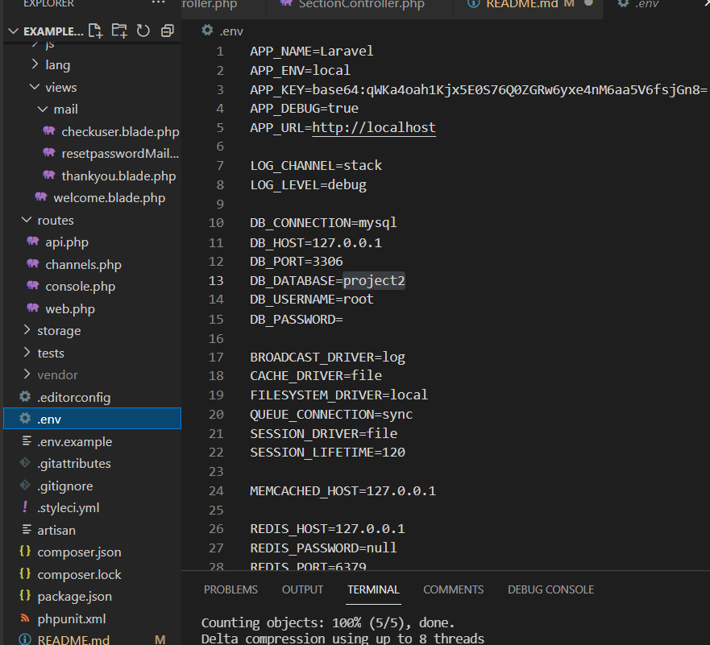
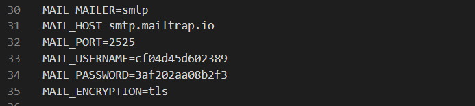
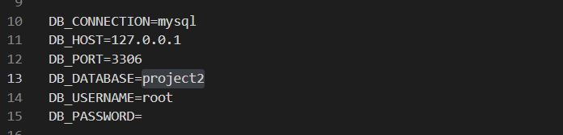
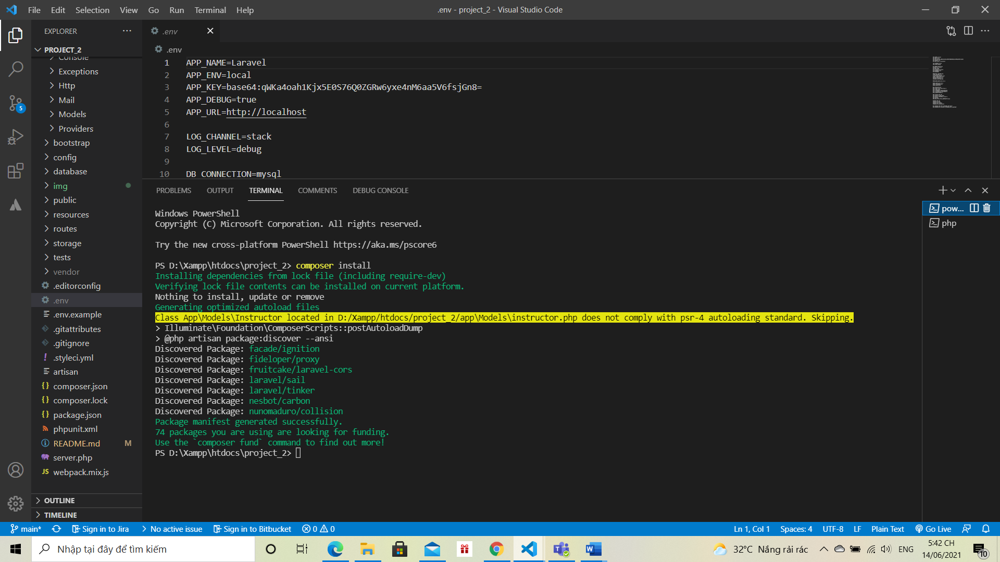
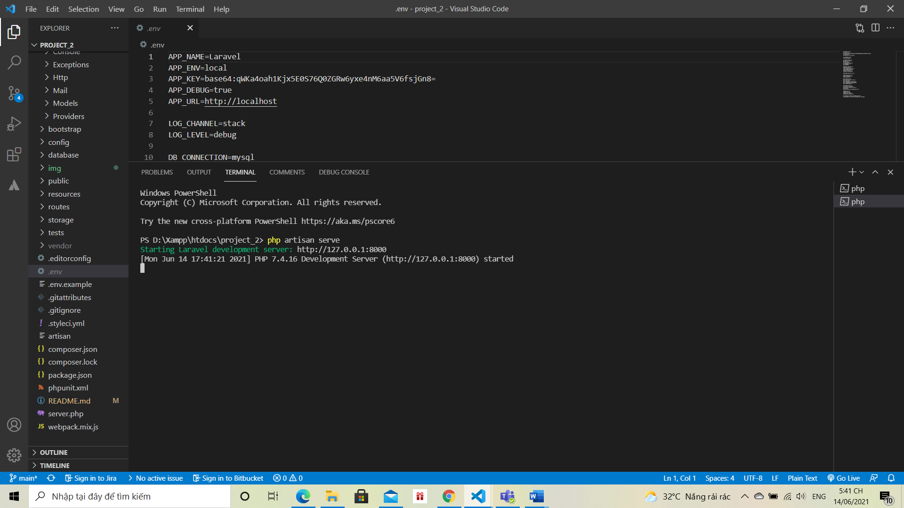

# CẤU HÌNH:
1. xampp: https://www.apachefriends.org/index.html .
2. composer: https://getcomposer.org/download/ .

# CÀI ĐẶT:
* clone project: https://github.com/Le-Tuan-2704/project-2 .
* thêm file .env
  
    

* cấu hình lại gửi email https://mailtrap.io/ trong file .env
  
    

* cài đặt cơ sở dữ liệu trên mysql có database: project2

    

* mở terminal trong folder project
    1. chạy lệnh:
        * composer i

            

# CHẠY CHƯƠNG TRÌNH:
 * mở terminal trong folder project
      1. chạy lệnh:
          * php artisan serve

            

**Lưu ý mọi API đều dùng cổng 8000**
